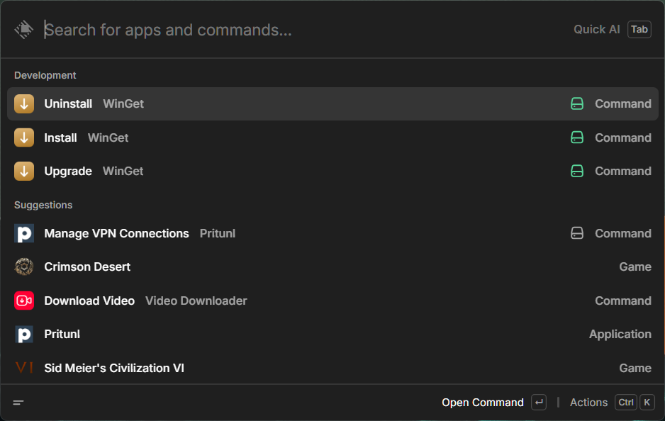
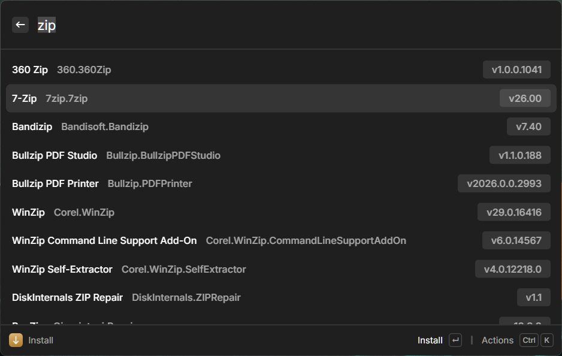
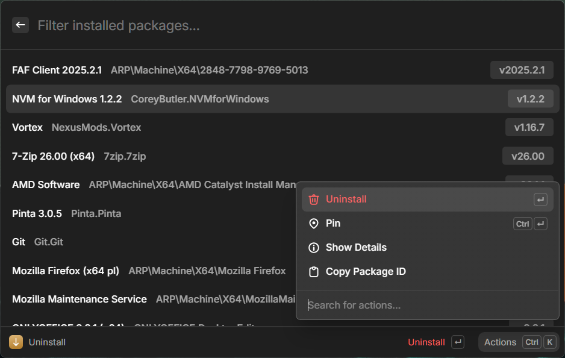
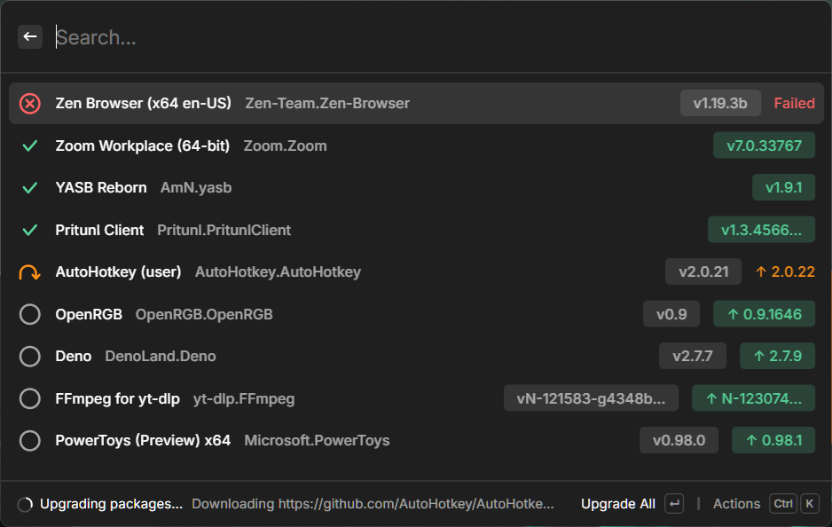
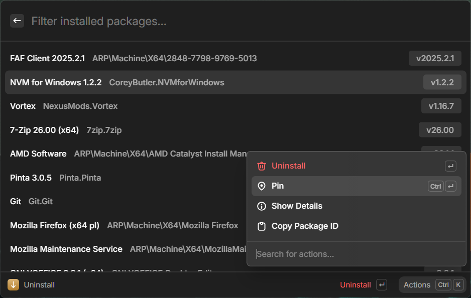

# WinGet

Manage Windows packages from Raycast using [WinGet](https://learn.microsoft.com/en-us/windows/package-manager/winget/), the Windows Package Manager.

# Requirements

- Windows 10 1709 or later (WinGet is included by default on Windows 11 and modern Windows 10)
- WinGet available in `PATH` — open a terminal and run `winget --version` to verify

# Features

### Install

Search the WinGet repository by name and install any package. Results show the package ID and version. Press **Enter** to start installing — the primary action switches to **Cancel** for the duration of the install so you can abort at any time.

### Uninstall

Browse all WinGet-managed packages installed on the system. Filter by name or ID. Press **Enter** to uninstall — the primary action switches to **Cancel** while the uninstall is running. Packages registered only in the Add/Remove Programs (ARP) database appear in the list but cannot be pinned or inspected via Show Details.

### Upgrade

View all packages that have an update available. Each row shows the current version and the version it will upgrade to. Packages can be upgraded individually or all at once with **Upgrade All**. Progress is tracked per-row with live status icons.

### Pin / Unpin

Packages can be pinned to exclude them from future upgrades. The pin state is loaded from WinGet on startup and reflected with a pin badge in the list. Available in both the **Uninstall** and **Upgrade** commands via the Actions menu.

### Show Details

Select **Show Details** in the Actions menu to open a detail view powered by `winget show`. Displays publisher, description, license, homepage, installer type, and more.
